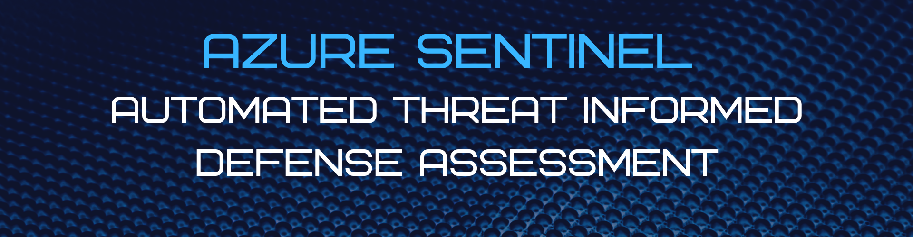
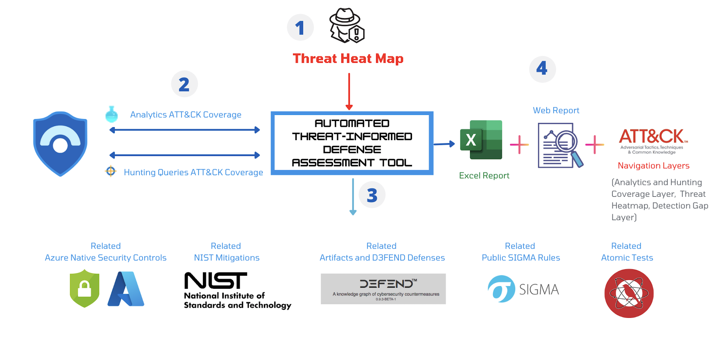

# Automated Threat-Informed Defense Assessment Tool

<!-- PROJECT SHIELDS -->
<!-- PROJECT LOGO -->



<!-- ABOUT THE PROJECT -->
## About The Project

Azure Sentinel Automated Threat-Informed Defense Assessment Tool helps you assess your Detection and hunting coverage against a threat Actor/profile.Furthermore, this tool enables defenders to start aligning their Sentinel day-to-day SOC operations with the MITRE ATT&CK framework. You just need to provide a threat profile as an ATT&CK Navigation layer (.json) and the tool will generate a report that include:

* Azure Sentinel covered MITRE tactics and Techniques by Analytics and Hunting queries (A Coverage Score)
* Related Azure native security controls, D3FEND defenses, NIST mitigations, Atomic Tests, Sigma Rules etc...

<!-- GETTING STARTED -->
## Getting Started

The project goes throuhg the following steps:


1. **Threat Profiling**

The first step is to provide the tool with a threat profile. The threat profile is represented as MITRE ATT&CK navigation layer. The infosec community already shares many navigation layers of threat profiles and mapped threat intelligence reports. One of them is the following:

* [DeTTECT Threat Actors Navigation Layers](https://github.com/rabobank-cdc/DeTTECT/tree/master/threat-actor-data/ATT%26CK-Navigator-layers "DeTTECT Threat Actors Navigation Layers") 

Further more the tool can help you generate a unified threat profile based on your geo-location and Industy. The available Coutries/regions and Sectors can be found in 'Resources/APT-groups.xlsx'

2. **Azure Sentinel Analytics and Hunting Query Coverage**

Once a threat heatmap is created. The tool connects to your Azure Sentinel environment and extracts the covered ATT&CK tactics and techniques automotically by your analytics and hunting queries. A coverage navigation layer will be created and exported as json a file that you can view using the MITRE ATT&CK navigator. The Coverage layer can be found in 'Reports/Coverage_layer.json'

3. **Gap Analysis and Related Recommendations**

In this step, the tool performs a gap analysis against the threat profile and generates a detecion gap matrix (navigation layer). Based on the gap matrix, the tool will provide you with the following:

* The Azure Native Security controls that can help you prevent and detect the threat tactic and techniques
* The related NIST mitigations to help you mitigate the threat actors techniques
* The related MITRE D3FEND artifacts and defenses 
* A list of recommended publically available SIGMA rules that you can rapidly use and deploy to detect the watched threat techniques 
* A list of recommended publically available Atomic tests that you can emulate to help you develop the needed detection rules/analytics and threat hunting queries. 

4. **Reporting**

The previously discussed sections will be generated as a Web report and excel file to help you align your operations to the MITRE ATT&CK framework and track your enhancements. 


## Project Details 


### Requirements

The tool needs the following python libraries

```
pyyaml=5.4.1
toml=0.10.2
requests=2.26.0
pandas=1.3.3
jinja2=3.0.1
openpyxl=3.0.9
simple_term_menu=1.4.1
stix2=3.0.1
taxii2-client=2.3.0
```

### How to use the tool

First clone the project

```
git clone <LINK>
```
Install the required libraries

```
cd tool
python3 tool -r requirements.txt
```
Edit the configuration file located at 'Config/Config.toml' with the Azure Sentinel API credentials

```
Azure_AD_Tenant =  <Azure_AD_Tenant Here>
Client_ID =  <Client_ID Here> 
Client_Secret = <Client_Secret Here> 
ResourceGroup =  <ResourceGroup Here>
Workspace =  <Workspace Here>
Subscription = <Subscription Here> 
```

### Video Demonstration

For a demonstration watch the following Video 
[YouTube Demo]("https://www.youtube.com/watch?v=APRsV7jHIYY&ab_channel=ChihebChebbi") 


